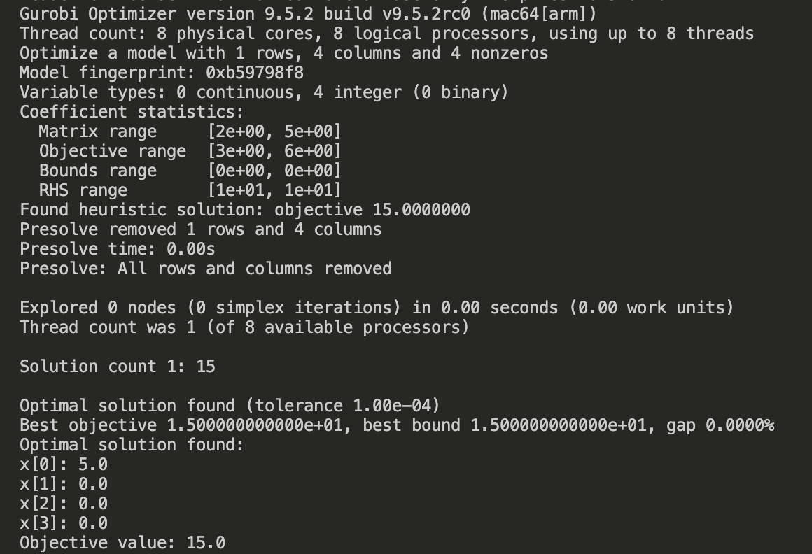

# 第三章 整数规划问题
整数规划是一种优化问题的特例，它要求优化**变量取值为整数**。相比线性规划，整数规划更为复杂，因为整数约束引入了离散性，这意味着优化算法不能简单地依赖于连续空间的性质。整数规划在实际应用中非常重要，因为许多决策问题的自然解是整数。

与线性规划不同，整数规划的求解方法需要考虑到优化变量取整数值的限制。常见的整数规划求解方法包括**分支定界法、割平面法、启发式方法和元启发式方法**。这些方法在尝试找到最优解的同时，遵循策略来有效地处理整数约束，通常会比解决相同问题的线性规划更为耗时。

这一节我们通过一个简单的背包问题的来展示整数规划问题的求解。本节目录：

[toc]

## 3.1 背包问题

一个背包具有固定的容量，你有一组物品，每个物品有一定的重量和价值。目标是选择一组物品放入背包，使得在不超过背包容量的前提下，物品的总价值最大化。

#### 具体问题

- 背包的容量为 $C$。
- 有 $n$ 个物品，每个物品 $i$ 有重量 $w_i$ 和价值 $v_i$。

#### 决策变量

- $x_i$：物品 $i$的放入数量，每个变量都为非负整数。

#### 数学模型

目标是最大化背包内物品的总价值：
$$\text{Maximize} \quad \sum_{i=1}^n v_i x_i$$

约束条件是所选物品的总重量不能超过背包的容量：
$$\text{Subject to} \quad \sum_{i=1}^n w_i x_i \leq C$$

并且，所有的 $x_i$ 都是非负整数变量：
$$x_i \geq 0$$
$$x_i \in \mathbb{Z}, \quad \forall i = 1, 2, \ldots, n$$

### 示例数据

假设有如下物品和背包容量：

| 物品 $i$ | 重量 $w_i$ | 价值 $v_i$ |
|:-----------:|:-------------:|:-------------:|
| 1           | 2             | 3             |
| 2           | 3             | 4             |
| 3           | 4             | 5             |
| 4           | 5             | 6             |

背包容量 $C = 10$。

#### 模型构建

对于上述数据，数学模型如下：

目标函数：
$$\text{Maximize} \quad 3x_1 + 4x_2 + 5x_3 + 8x_4$$

约束条件：
$$2x_1 + 3x_2 + 4x_3 + 5x_4 \leq 5$$
$$x_i >          = 0$$
$$x_i \in  \mathbb{Z}, \quad \forall i = 1, 2, \ldots, n$$

这个模型要求在不超过背包容量的前提下，最大化选入背包的物品的总价值。

## 3.2 问题求解

接下来只需将上面的数学模型翻译成计算机能够理解的编程代码，然后扔给求解器计算即可。

#### Gurobi
以下为使用 Gurobi 求解器求解的代码：

```python
import gurobipy as gp
from gurobipy import GRB

# 物品信息
weights = [2, 3, 4, 5] # 每件物品的重量
values  = [3, 4, 5, 6] # 每件物品的价值
capacity = 10 # 背包的容量

# 创建模型
model = gp.Model("knapsack_problem")

# 添加变量
x = model.addVars(len(weights), lb=0, vtype=GRB.INTEGER, name="x")

# 设置目标函数
model.setObjective(gp.quicksum(values[i] * x[i] for i in range(len(weights))), GRB.MAXIMIZE)

# 添加约束条件
model.addConstr(gp.quicksum(weights[i] * x[i] for i in range(len(weights))) <= capacity, "weight_limit")

# 模型求解
model.optimize()

# 输出结果
if model.status == GRB.OPTIMAL:
    print("Optimal solution found:")
    for v in model.getVars():
        print(f"{v.varName}: {v.x}")
    print(f"Objective value: {model.objVal}")
else:
    print("No optimal solution found.")

```
求解结果如下：



可以看到最优结果为放入物品一5件，最大价值为10。

#### Copt
以下为使用 Copt 求解器求解的代码：
```python
import coptpy as cp
from coptpy import COPT

# 物品信息
weights = [2, 3, 4, 5] # 每件物品的重量
values  = [3, 4, 5, 6] # 每件物品的价值
capacity = 10 # 背包的容量

# 创建 COPT 环境
env = cp.Envr()

# 创建模型
model = env.createModel("knapsack_problem")

# 添加变量
x = model.addVars(len(weights), lb=0, vtype=COPT.INTEGER, nameprefix="x")

# 设置目标函数
model.setObjective(cp.quicksum(values[i] * x[i] for i in range(len(weights))), COPT.MAXIMIZE)

# 添加约束条件
model.addConstr(cp.quicksum(weights[i] * x[i] for i in range(len(weights))) <= capacity, "weight_limit")

# 模型求解
model.solve()

# 输出结果
if model.status == COPT.OPTIMAL:
    print("Optimal solution found:")
    for v in model.getVars():
        print(f"{v.getName()}: {v.x}")
    print(f"Objective value: {model.objVal}")
else:
    print("No optimal solution found.")
```

求解结果如下：


COPT 的计算结果和 Gurobi 一致。