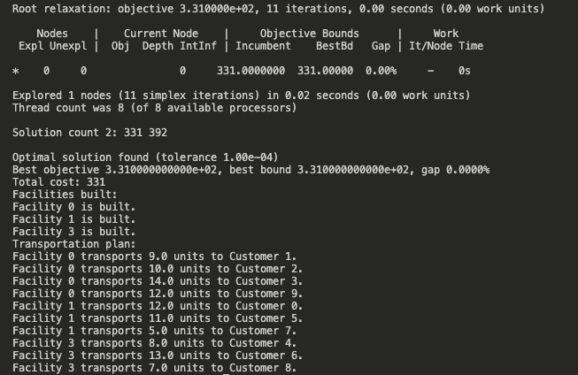
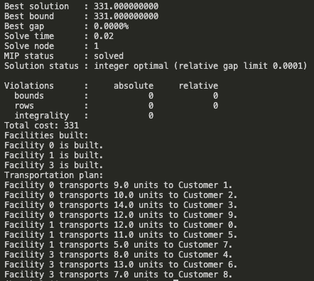

# 第四章 混合整数规划

混合整数规划（Mixed-Integer Programming, MIP）可以看成是线性规划和整数规划的结合，要求**决策变量同时包含连续变量和整数变量**，是实际应用场景中最常见的一种优化问题。

本文目录如下：

- [第四章 混合整数规划](#第四章-混合整数规划)
  - [1. 基本概念](#1-基本概念)
    - [1.1 简介](#11-简介)
    - [1.2 整数规划与混合整数规划的区别](#12-整数规划与混合整数规划的区别)
  - [2. 模型构建与求解](#2-模型构建与求解)
    - [2.1 模型构建](#21-模型构建)
    - [2.2 求解方法](#22-求解方法)
      - [2.2.1 精确算法](#221-精确算法)
      - [2.2.2 启发式算法](#222-启发式算法)
  - [3. 代码实战](#3-代码实战)
    - [3.1 问题描述](#31-问题描述)
    - [3.2 数学模型](#32-数学模型)
      - [集合和参数](#集合和参数)
      - [变量](#变量)
      - [目标函数](#目标函数)
      - [约束条件](#约束条件)
    - [3.3 代码求解](#33-代码求解)
      - [3.3.1 Gurobi 求解](#331-gurobi-求解)
      - [3.3.2 Copt 求解](#332-copt-求解)


## 1. 基本概念

### 1.1 简介

混合整数规划是一类优化问题，其目标是优化某个线性目标函数，同时满足一组线性约束条件。其中，决策变量既可以是**连续变量**（取值在实数范围内），也可以是**整数变量**（取值在整数范围内）。形式上，MIP 问题可以表示为：

$$ \min / \max \ \mathbf{c}^T \mathbf{x} $$

subject to

$$ \mathbf{A} \mathbf{x} \leq \mathbf{b} $$

$$ \mathbf{x}_i \in \mathbb{Z}, \ \forall i \in \mathcal{I} $$

$$ \mathbf{x}_j \in \mathbb{R}, \ \forall j \in \mathcal{C} $$

其中，$\mathbf{x}$ 是决策变量向量，$\mathbf{c}$ 是目标函数系数向量，$\mathbf{A}$ 是约束矩阵，$\mathbf{b}$ 是约束右端项向量，$\mathcal{I}$ 和 $\mathcal{C}$ 分别表示整数变量和连续变量的索引集合。

### 1.2 整数规划与混合整数规划的区别

整数规划（Integer Programming, IP）是混合整数规划的一个特例，所有的决策变量都是整数。而混合整数规划则允许决策变量既包含整数变量也包含连续变量，从而具有更广泛的应用场景。

## 2. 模型构建与求解

### 2.1 模型构建

混合整数规划的模型构建通常包括以下几个步骤：

1. **确定决策变量**
    首先，需要明确问题中的决策变量。决策变量可以是连续变量、整数变量或二进制变量（取值为0或1）。

2. **构建目标函数**
    目标函数通常是决策变量的线性组合，表示需要最小化或最大化的指标，如成本、利润、时间等。

3. **确定约束条件**
    约束条件是对决策变量的限制，通常表示为线性不等式或等式。例如，资源限制、需求满足、生产能力等。


### 2.2 求解方法

混合整数规划问题通常比较难以求解，其求解方法主要包括以下几类：

#### 2.2.1 精确算法

精确算法能够保证求解出最优解，常见的方法包括：

- **分支定界法（Branch and Bound）**：通过分解原问题和限定搜索空间逐步逼近最优解。
- **割平面法（Cutting Plane）**：通过添加有效约束逐步缩小可行解空间。
- **分支切割法（Branch and Cut）**：结合分支定界法和割平面法的优势。

#### 2.2.2 启发式算法

启发式算法不能保证找到全局最优解，但能在较短时间内找到近似最优解，常见的方法包括：

- **模拟退火（Simulated Annealing）**
- **遗传算法（Genetic Algorithm）**
- **禁忌搜索（Tabu Search）**

## 3. 代码实战

这里我们来看一个经典的混合整数规划问题：设施选址问题（Facility Location Problem）。

设施选址问题涉及在若干个候选地点中选择一些地点来建立设施，以最小化建设和运营成本，同时满足需求点的需求。

### 3.1 问题描述
- **候选设施地点**: 有若干个候选设施地点，每个设施地点有一个固定的建设成本。
- **需求点**   : 有若干个需求点，每个需求点的需求量已知。
- **运输成本**  : 设施地点到需求点的运输成本已知。
- **目标**    : 最小化总成本（建设成本和运输成本）。

### 3.2 数学模型

#### 集合和参数
- $ I $: 候选设施地点集合。
- $ J $: 需求点集合。
- $ f_i $: 在设施地点 $ i $ 建设设施的固定成本。
- $ c_{ij} $: 从设施地点 $ i $ 向需求点 $ j $ 运输单位需求的成本。
- $ d_j $: 需求点 $ j $ 的需求量。

#### 变量
- $ x_i $: 二进制变量，表示是否在设施地点 $ i $ 建设设施（1 为建设，0 为不建设）。
- $ y_{ij} $: 连续变量，表示从设施地点 $ i $ 向需求点 $ j $ 运输的数量。

#### 目标函数
最小化总成本：
$$ \text{Minimize} \quad \sum_{i \in I} f_i x_i + \sum_{i \in I} \sum_{j \in J} c_{ij} y_{ij} $$

#### 约束条件
1. 每个需求点的需求必须得到满足：
$$ \sum_{i \in I} y_{ij} = d_j \quad \forall j \in J $$

2. 每个需求点的需求只能由已建设的设施来供应：
$$ y_{ij} \leq d_j x_i \quad \forall i \in I, \forall j \in J $$

3. 二进制变量约束：
$$ x_i \in \{0, 1\} \quad \forall i \in I $$

4. 连续变量非负约束：
$$ y_{ij} \geq 0 \quad \forall i \in I, \forall j \in J $$

注意约束3和4在编写代码时可以直接写进变量定义，以减少约束数量，加快求解。

### 3.3 代码求解

这里我们分别采用 Gurobi 和 Copt 求解器进行求解。

#### 3.3.1 Gurobi 求解
以下是用 Gurobi 求解的代码：

```python
import numpy as np
from gurobipy import Model, GRB, quicksum

# 设置随机种子，确保程序每次运行结果一致
np.random.seed(1)

# 定义候选设施地点和需求点数量
num_facilities = 5
num_customers  = 10

# 随机生成设施建设成本和运输成本
facility_costs  = np.random.randint(10, 100, size=num_facilities)
transport_costs = np.random.randint(1, 10, size=(num_facilities, num_customers))
demands         = np.random.randint(5, 15, size=num_customers)

# 创建模型
model = Model('FacilityLocation')

# 添加变量
x = model.addVars(num_facilities, vtype=GRB.BINARY, name="x")  # 设施建设决策变量
y = model.addVars(num_facilities, num_customers, vtype=GRB.CONTINUOUS, name="y")  # 运输数量变量

# 设定目标函数：最小化总成本
model.modelSense = GRB.MINIMIZE
model.setObjective(quicksum(facility_costs[i] * x[i] for i in range(num_facilities)) + \
                   quicksum(transport_costs[i][j] * y[i, j] \
                            for i in range(num_facilities) \
                            for j in range(num_customers)))

# 添加约束条件
# 每个需求点的需求必须得到满足
model.addConstrs((quicksum(y[i, j] \
                           for i in range(num_facilities)) == demands[j] \
                            for j in range(num_customers)), \
                            name="demand")

# 运输数量约束
model.addConstrs((y[i, j] <= demands[j] * x[i] \
                  for i in range(num_facilities) \
                    for j in range(num_customers)), \
                        name="transport")

# 优化模型
model.optimize()

# 输出结果
if model.status == GRB.OPTIMAL:
    print('Total cost: %g' % model.objVal)
    print('Facilities built:')
    for i in range(num_facilities):
        if x[i].x > 0.5:
            print(f'Facility {i} is built.')
    print('Transportation plan:')
    for i in range(num_facilities):
        for j in range(num_customers):
            if y[i, j].x > 0.1:
                print(f'Facility {i} transports {y[i, j].x} units to Customer {j}.')
else:
    print('No optimal solution found.')
```

Gurobi 的求解结果如下: 



可以看到最优目标函数值（Best objective）为 3.31e+02，即331，同时也是总成本（total cost）。

最优的设施选点为0，1，3号点，以及详细的运输计划（Transportation plan）。

#### 3.3.2 Copt 求解

对于 COPT，代码结构类似，只需要将 Gurobi 的相关调用替换为 COPT 的调用即可。

```python
import numpy as np
import coptpy as cp
from coptpy import COPT, quicksum

# 设置随机种子，确保程序每次运行结果一致
np.random.seed(1)

# 定义候选设施地点和需求点数量
num_facilities = 5
num_customers  = 10

# 随机生成设施建设成本和运输成本
facility_costs  = np.random.randint(10, 100, size=num_facilities)
transport_costs = np.random.randint(1, 10, size=(num_facilities, num_customers))
demands         = np.random.randint(5, 15, size=num_customers)

# 创建模型
env   = cp.Envr()
model = env.createModel('FacilityLocation')

# 添加变量
x = model.addVars(num_facilities, vtype=COPT.BINARY, nameprefix="x")  # 设施建设决策变量
y = model.addVars(num_facilities, num_customers, vtype=COPT.CONTINUOUS, nameprefix="y")  # 运输数量变量

# 设定目标函数：最小化总成本
model.setObjective(quicksum(facility_costs[i] * x[i] \
                            for i in range(num_facilities)) \
                                + \
                   quicksum(transport_costs[i][j] * y[i, j] \
                            for i in range(num_facilities) \
                            for j in range(num_customers)), \
                    sense=COPT.MINIMIZE)

# 添加约束条件
# 每个需求点的需求必须得到满足
model.addConstrs((quicksum(y[i, j] \
                    for i in range(num_facilities)) == demands[j] \
                    for j in range(num_customers)), \
                    nameprefix="demand")

# 运输数量约束
model.addConstrs((y[i, j] <= demands[j] * x[i] \
                  for i in range(num_facilities) \
                  for j in range(num_customers)), \
                    nameprefix="transport")

# 优化模型
model.solve()

# 输出结果
if model.status == COPT.OPTIMAL:
    print('Total cost: %g' % model.objval)
    print('Facilities built:')
    for i in range(num_facilities):
        if x[i].x > 0.5:
            print(f'Facility {i} is built.')
    print('Transportation plan:')
    for i in range(num_facilities):
        for j in range(num_customers):
            if y[i, j].x > 0.1:
                print(f'Facility {i} transports {y[i, j].x} units to Customer {j}.')
else:
    print('No optimal solution found.')
```

Copt 的求解结果如下：



结果和 Gurobi 的求解结果一致，总成本皆为331，设施选点为0，1，3号点。