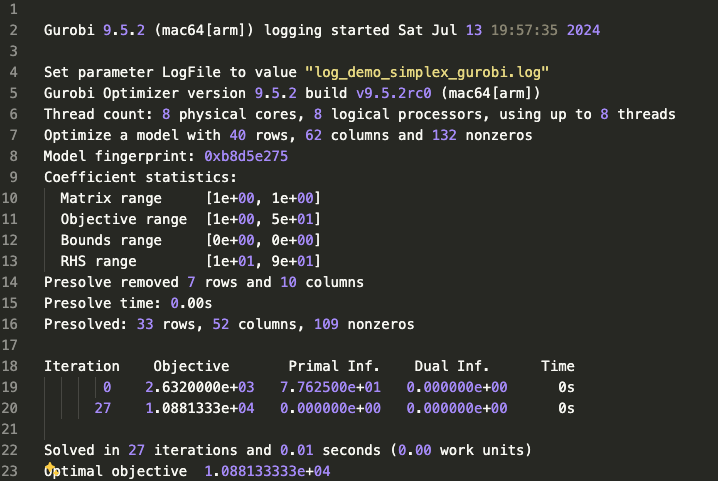
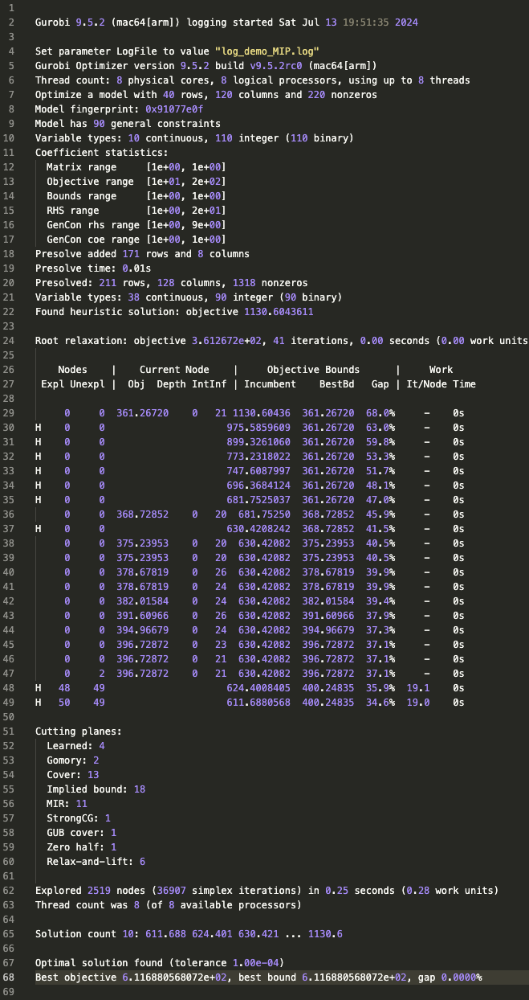
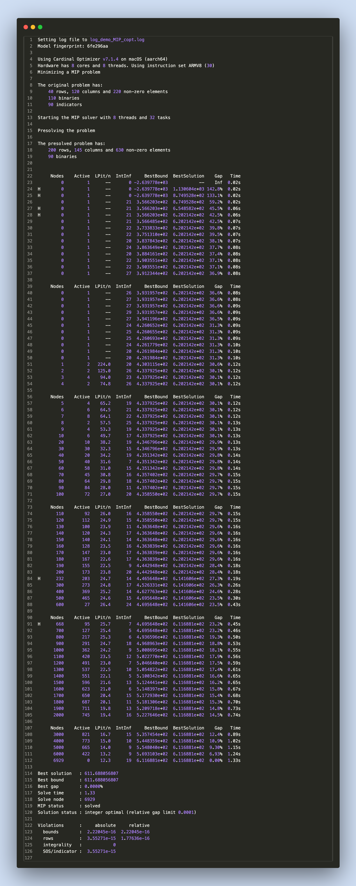

# 第六章 解读求解器日志

看懂求解器日志可以帮助我们监控和理解优化过程，评估求解器的性能和效率，识别可能的瓶颈或问题，并根据日志信息调整模型或参数以改善求解效果。

本文目录：
[toc]

## 6.1 求解器求解问题的一般步骤

首先我们来了解一下求解器在求解优化问题时的一般步骤，帮助我们更好地理解求解器的求解日志。

### 6.1.1 线性规划问题
对于线性规划问题时，求解器通常遵循以下一般步骤：

1. **模型初始化**

   - 定义问题：确定目标函数、约束条件和变量。
   - 输入数据：将目标函数和约束条件转化为矩阵形式并输入求解器。

2. **预处理与预求解**

   - 缩放和规范化：调整系数的规模，减少数值误差。
   - 简化模型：通过消除冗余约束和变量，简化模型。

3. **选择算法**

   - 确定求解方法：根据问题的特点选择适当的算法，如单纯形法、内点法等。

4. **求解过程**

   - 初始可行解：确定初始可行解，以便开始迭代过程。
   - 迭代求解：通过选择和调整基变量与非基变量，逐步逼近最优解。常用方法有：
     - 单纯形法：逐步沿着约束多面体的边界移动，寻找最优解。
     - 内点法：从多面体内部逐步向最优解移动。
     - 对偶单纯形法：处理对偶问题的变形，特别适用于某些特殊结构的线性规划问题。

5. **结果分析与输出**

   - 检查可行性：确保得到的解满足所有约束条件。
   - 计算目标值：计算并输出目标函数的最优值。
   - 求解状态：确定求解过程是否成功完成，是否达到最优解或是否存在无解或无界解的情况。
   - 输出结果：输出最优解和目标值，可能包括变量值、约束松弛值等。

### 6.1.2 混合整数规划问题

对于混合整数规划问题（MIP），求解器的一般计算步骤为：

1. **模型构建**
   - 定义决策变量：确定问题中的决策变量，并定义这些变量的类型（连续、整数、二进制等）。
   - 设定目标函数：明确需要最大化或最小化的目标函数。
   - 添加约束条件：定义问题中的各种约束条件，包括等式和不等式约束。
2. **模型预求解**
   - 检查模型的可行性：在开始求解之前，求解器会检查模型的约束是否矛盾，以确保模型有可能存在可行解。
   - 简化模型：求解器会尝试简化模型，例如消除冗余约束、固定显然的变量等。
3. **求解松弛问题**
   - 忽略整数约束：对于混合整数规划问题，求解器首先会忽略整数约束，求解相应的线性规划（LP）松弛问题。
   - 初步求解：使用高效的LP算法（如单纯形法、内点法）求解松弛问题，得到初步解。
4. **分支定界（Branch and Bound）**
   - 初始化：从松弛问题的最优解开始，作为初始节点。
   - 分支（Branching）：选择一个非整数变量进行分支，创建两个新的子问题（一个变量取下界，另一个变量取上界）。
   - 定界（Bounding）：对每个子问题，计算其上下界。如果子问题的解优于当前已知的最佳整数解，则更新最佳解。
   - 剪枝（Pruning）：如果某个子问题的上下界表明它不可能包含更优的解，则剪枝该子问题，避免进一步计算。
5. **割平面法（Cutting Planes）**
   - 添加割平面：在求解过程中，如果发现当前解不是整数解，求解器会通过添加割平面（额外约束）来逼近整数解。
   - 迭代求解：反复求解添加割平面后的松弛问题，逐步逼近整数解。
6. **启发式方法**
   - 启发式求解：在求解过程中，求解器可能使用启发式方法快速找到一个可行解，作为当前已知的最佳解。
   - 改进启发式解：通过局部搜索或其他方法进一步改进启发式找到的解。
7. **优化终止**
   - 最优解判断：当所有子问题都被处理或剪枝，求解器判断当前最优解是否满足最优性条件。
   - 终止条件：满足以下任一条件时，求解过程终止：
     - 找到全局最优解。
     - 超过预设的时间或迭代次数限制。
     - 达到设定的最优性容忍度。
8. **结果输出**
   - 输出最优解：如果求解器找到最优解，则输出最优解的值和对应的决策变量。
   - 结果分析：提供求解过程中的统计信息，如迭代次数、求解时间、剪枝次数等。


## 6.2 获取求解器日志

在Gurobi和Copt中，可以通过设置参数来控制和获取求解器的日志。以下是详细的设置方法。

### 6.2.1 Gurobi

在Gurobi中，可以通过设置`OutputFlag`和`LogFile`参数来控制日志的输出和记录。

#### 设置日志输出

```python
import gurobipy as gp

# 创建模型
model = gp.Model("example")

# 设置日志输出
model.setParam('OutputFlag', 1)  # 打开日志输出，默认为1（开启）
model.setParam('LogFile', 'gurobi.log')  # 将日志写入文件

# 添加变量、约束和目标函数
# ...

# 求解模型
model.optimize()
```

#### 关闭日志输出

```python
model.setParam('OutputFlag', 0)  # 关闭日志输出
```

#### 设置日志详细程度

```python
model.setParam('LogToConsole', 1)  # 控制台输出日志
model.setParam('LogFile', 'gurobi.log')  # 将日志写入文件
```

### 6.2.2 Copt

在Copt中，可以通过`setLogFile`函数来输出求解日志。

#### 设置日志输出

```python
import coptpy as cp

# 创建环境和模型
env = cp.Envr()
model = env.createModel("example")

# 设置日志输出
model.setLogFile('copt.log')

# 添加变量、约束和目标函数
# ...

# 求解模型
model.solve()
```


## 6.3 日志解读

### 6.3.1 Gurobi
首先，我们来看 Gurobi 的求解日志。根据不同的问题类型，Gurobi 会采用不同的求解方法进行计算。

本节介绍常见的两种问题下的日志：线性规划和混合整数规划。

#### （1）线性规划问题

对于线性规划问题，常见的解法为采用单纯形法进行求解，如下图所示：



Gurobi在很多情况下会默认使用对偶单纯形法（Dual Simplex Method），因为它在处理许多实际问题时表现得非常高效。

以下是对这个 log 的详细解读：

1. 日志头部信息
```
Gurobi 9.5.2 (mac64[arm]) logging started Sat Jul 13 19:57:35 2024
Set parameter LogFile to value "log_demo_simplex_gurobi.log"
Gurobi Optimizer version 9.5.2 build v9.5.2rc0 (mac64[arm])
Thread count: 8 physical cores, 8 logical processors, using up to 8 threads
```
- **Gurobi版本和平台**：日志开始时记录了Gurobi的版本信息（9.5.2）和运行平台（mac64[arm]）。
- **日志文件**：参数`LogFile`设置为"log_demo_simplex_gurobi.log"，表示日志将记录到该文件中。
- **线程数（Thread count）**：Gurobi使用的线程数为8个，既包括物理核心也包括逻辑处理器。

2. 模型信息
```
Optimize a model with 40 rows, 62 columns and 132 nonzeros
Model fingerprint: 0xb8d5e275
```
- **模型维度**：模型包含40个约束（行，rows）、62个变量（列，columns）和132个非零系数（nonzeros）。
- **模型指纹（Model fingerprint）**：模型指纹是模型的唯一标识符，为一个哈希字符。它记录了模型的结构和数据。**只有当两个模型的指纹完全一致时，两者才具有可比性**。注意，由于不同电脑的性能、进程和内存情况不完全一致，即使模型指纹相同，最后的模型求解时间出现不同也是正常现象。

3. 系数统计（Coefficient statistics）
```
Coefficient statistics:
  Matrix range     [1e+00, 1e+00]
  Objective range  [1e+00, 5e+01]
  Bounds range     [0e+00, 0e+00]
  RHS range        [1e+01, 9e+01]
```
- **矩阵范围（Matrix range）**：约束矩阵中的系数范围为1到1（表示所有系数相同）。
- **目标函数范围（Objective range）**：目标函数系数范围为1到50。
- **变量界限范围（Bounds range）**：变量界限范围为0到0（表示无界）。
- **右端项范围（RHS range）**：约束条件右端的常数项范围为10到90。

4. 预求解阶段（presolve）
```
Presolve removed 7 rows and 10 columns
Presolve time: 0.00s
Presolved: 33 rows, 52 columns, 109 nonzeros
```
- **预求解**：预求解阶段移除了7个约束和10个变量。
- **预时间**：预求解耗时0.00秒。
- **预求解后（Presolved）模型**：预求解后的模型包含33个约束、52个变量和109个非零系数。

通常情况下，预求解阶段，求解器能够识别并删除冗余约束，减少不必要的变量，降低优化问题的规模，提高求解效率。

5. 求解过程（Progress）
```
Iteration    Objective       Primal Inf.    Dual Inf.      Time
       0    2.6320000e+03   7.762500e+01   0.000000e+00      0s
      27    1.0881333e+04   0.000000e+00   0.000000e+00      0s
```
- **迭代过程**：记录了迭代次数（Iteration）、目标值（Objective）、原始问题（Primal Inf）和对偶问题（Dual Inf）的不满足度（即当前解的约束和边界的违反程度）以及耗时（Time）。
  - 第0次迭代：目标值为2632.0，原始问题不满足度为77.625（较高），对偶问题不满足度为0。
  - 第27次迭代：目标值为10881.333，原始问题和对偶问题的不满足度均为0（表示已经找到可行解）。

6. 求解结果（Summary）
```
Solved in 27 iterations and 0.01 seconds (0.00 work units)
Optimal objective  1.088133333e+04
```
- **求解耗时**：整个求解过程用了27次迭代和0.01秒。
- **工作单元**：工作单元为0.00（表示工作量很小）。
- **最优解**：最优目标值为10881.333。


#### （2）混合整数规划

求解混合整数规划问题一般会用到分支定界法（Branch and Bound Method）。下图为混合整数规划问题求解日志示例：



下面是对该 Gurobi 求解日志的详细解读：

1. 初始信息
```
Gurobi Optimizer version 9.5.2 build v9.5.2rc0 (mac64[arm])
Thread count: 8 physical cores, 8 logical processors, using up to 8 threads
```
Gurobi Optimizer版本信息，以及硬件配置：8个物理核、8个逻辑处理器，使用最多8个线程进行计算。

2. 模型信息
```
Optimize a model with 40 rows, 120 columns and 220 nonzeros
Model fingerprint: 0x91077e0f
Model has 90 general constraints
Variable types: 10 continuous, 110 integer (110 binary)
```
- 模型包含40个约束（行），120个变量（列），220个非零元素。
- 模型的“指纹”是0x91077e0f（一个唯一标识模型的哈希值）。
- 模型有90个一般约束。
- 变量类型：10个连续变量，110个整数变量（其中110个是二元变量）。

3. 系数统计
```
Coefficient statistics:
  Matrix range     [1e+00, 1e+00]
  Objective range  [1e+01, 2e+02]
  Bounds range     [1e+00, 1e+00]
  RHS range        [1e+00, 2e+01]
  GenCon rhs range [1e+00, 9e+00]
  GenCon coe range [1e+00, 1e+00]
```
- 系数矩阵的范围：从1到1
- 目标函数系数范围：从10到200
- 变量界限的范围：从1到1
- 右端项（RHS）的范围：从1到20
- 一般约束的RHS范围：从1到9
- 一般约束的系数范围：从1到1

4. 预求解阶段
```
Presolve added 171 rows and 8 columns
Presolve time: 0.01s
Presolved: 211 rows, 128 columns, 1318 nonzeros
Variable types: 38 continuous, 90 integer (90 binary)
```
- 预求解添加了171个约束（rows）和8个变量（columns）。
- 预求解时间为0.01秒。
- 预求解后模型包含211个约束，128个变量和1318个非零元素。
- 变量类型变为38个连续变量和90个整数变量（其中90个是二元变量）。

预求解后约束和变量的个数反而增多了，这可能是因为引入了一些辅助变量，将一些非线性或复杂的约束转化为多个简单的线性约束。

5. 启发式求解
```
Found heuristic solution: objective 1130.6043611
```

在早期求解过程中，通过启发式算法（heuristic）找到了一个**初始可行解**，目标值为1130.6043611。启发式解为分支定界算法提供了一个初始的上界，有助于在初始阶段快速确定一个可行解，从而指导后续的搜索过程。

6. 根节点松弛
```
Root relaxation: objective 3.612672e+02, 41 iterations, 0.00 seconds (0.00 work units)
```

根节点松弛后的目标值为361.2672，进行了41次迭代，耗时0.00秒。

根节点松弛（Root relaxation）是求解分支定界过程中的第一个步骤，它计算的是**不考虑整数约束时的线性松弛问题的最优解**。根节点松弛提供了一个下界，用于评估分支定界过程中节点的优劣，从而指导搜索过程。

7. 分支定界过程
```
    Nodes    |    Current Node    |     Objective Bounds      |     Work
 Expl Unexpl |  Obj  Depth IntInf | Incumbent    BestBd   Gap | It/Node Time

     0     0  361.26720    0   21 1130.60436  361.26720  68.0%     -    0s
H    0     0                     975.5859609  361.26720  63.0%     -    0s
H    0     0                     899.3261060  361.26720  59.8%     -    0s
H    0     0                     773.2318022  361.26720  53.3%     -    0s
H    0     0                     747.6087997  361.26720  51.7%     -    0s
H    0     0                     696.3684124  361.26720  48.1%     -    0s
H    0     0                     681.7525037  361.26720  47.0%     -    0s
     0     0  368.72852    0   20  681.75250  368.72852  45.9%     -    0s
H    0     0                     630.4208242  368.72852  41.5%     -    0s
     0     0  375.23953    0   20  630.42082  375.23953  40.5%     -    0s
     0     0  375.23953    0   20  630.42082  375.23953  40.5%     -    0s
     0     0  378.67819    0   26  630.42082  378.67819  39.9%     -    0s
     0     0  378.67819    0   24  630.42082  378.67819  39.9%     -    0s
     0     0  382.01584    0   24  630.42082  382.01584  39.4%     -    0s
     0     0  391.60966    0   26  630.42082  391.60966  37.9%     -    0s
     0     0  394.96679    0   24  630.42082  394.96679  37.3%     -    0s
     0     0  396.72872    0   23  630.42082  396.72872  37.1%     -    0s
     0     0  396.72872    0   21  630.42082  396.72872  37.1%     -    0s
     0     2  396.72872    0   21  630.42082  396.72872  37.1%     -    0s
H   48    49                     624.4008405  400.24835  35.9%  19.1    0s
H   50    49                     611.6880568  400.24835  34.6%  19.0    0s
```

分支定界算法是一种用于解决混合整数规划问题的算法。它通过**分裂问题的可行域，并在每个分裂上计算界限，逐步缩小搜索空间**，以便找到最优解或接近最优解的方法。

- 第1, 2列为节点数（Nodes），包括已探索（Expl）和未探索（Unexpl）的节点数。节点为0说明还在根节点进行搜索，节点数大于1说明进入了叶子节点搜索，叶子结点搜索一般会比较耗时，有可能找不到最优解。
- 最左边的 `H` 表明启发式算法（Heuristic）搜索到了一个可行解，如果是 `*` 则表明分支定界（branching）搜索到了可行解。
- 第3到5列为当前节点的信息，包括当前目标值（Obj）、深度（Depth）、整型无穷量（IntInf）。IntInf 在变化，说明的还未找到可行解。当左边的 `H` 符号出现时，说明启发式找到可行解，此时 IntInf 等不显示是正常的。
- 第6到8列为最重要的当前解的信息，包括：
  - **Incumbent**：当前找到的最优整数解的目标值。在求解过程中，每找到一个新的更好的整数解，这个值会被更新。它是分支定界算法中的上界，提供了当前最好的已知解。
  - **BestBd**：代表当前的最优下界，即分支定界过程中尚未完全求解的节点中目标值的最小可能值。它是基于松弛问题（通常是根节点松弛和后续节点的松弛）的结果得出的。这个值不断更新，通常通过分支和剪枝策略来提高。
  - **Gap**：代表当前解的相对差距，用百分比表示，计算公式为 $\frac{(Incumbent - BestBnd)}{|Incumbent|} \times 100$。这个值显示了当前找到的最优解和最优下界之间的距离。它用于衡量求解进度，当Gap达到用户设定的阈值（如默认的0.01%）时，求解器会停止，认为已找到足够好的解。
- 第9到10列为每个节点的迭代次数和时间等信息。注意这个 Time 如果一直为0且第1列的node一直为0说明求解器还在处理根节点，需要花时间产生切平面，以及尝试多种启发式，来减少分支定界树的规模。
- 有时候gap已经达到了要求，但是求解还不结束，大概率是因为有个启发式算法还没算完，在等他算完。

8. 割平面法（Cutting planes）
```
Cutting planes:
  Learned: 4
  Gomory: 2
  Cover: 13
  Implied bound: 18
  MIR: 11
  StrongCG: 1
  GUB cover: 1
  Zero half: 1
  Relax-and-lift: 6
```
- 使用了以下多种割平面方法来加速求解：
  - Learned       : 4
  - Gomory        : 2
  - Cover         : 13
  - Implied bound : 18
  - MIR           : 11
  - StrongCG      : 1
  - GUB cover     : 1
  - Zero half     : 1
  - Relax-and-lift: 6

割平面的作用：
- 加强松弛：切平面通过增加新的约束，使得原本松弛的LP解更接近于整数解，从而**缩小搜索空间**。
- 减少分支定界节点数：通过有效地**裁剪**不可能包含最优解的部分，使得分支定界过程中需要探索的节点数减少，加快求解速度。

9. 总结
```
Explored 2519 nodes (36907 simplex iterations) in 0.26 seconds (0.28 work units)
Thread count was 8 (of 8 available processors)

Solution count 10: 611.688 624.401 630.421 ... 1130.6

Optimal solution found (tolerance 1.00e-04)
Best objective 6.116880568072e+02, best bound 6.116880568072e+02, gap 0.0000%
```
- 总共探索了2519个节点，进行了36907次单纯形迭代，耗时0.26秒。
- 使用了8个线程。
- 找到了10个解，最优解的目标值为611.688。
- 找到了最优解，目标值为611.6880568072

最佳界与目标值一致，Gap为0.0000%。

### 6.3.2 Copt
Copt 求解器的日志和 Gurobi 基本相似，但有一些细微差异。

#### （1）线性规划问题

首先来看 COPT 的线性规划问题求解日志：


可以看到和 Gurobi 的求解日志基本相似，都采用了对偶单纯形法进行求解。以下是详细解读：

1. **Log File**:
    ```
    Setting log file to log_demo_simplex_copt.log
    ```
    设置日志文件为 `log_demo_simplex_copt.log`。

2. **模型指纹**:
    ```
    Model fingerprint: 53c794f8
    ```
    模型指纹用于标识模型的唯一性。

3. **求解器和系统信息**:
    ```
    Using Cardinal Optimizer v7.1.4 on macOS (aarch64)
    Hardware has 8 cores and 8 threads. Using instruction set ARMV8 (30)
    ```
    使用 Cardinal Optimizer v7.1.4 在 macOS (aarch64) 系统上进行求解。硬件有8个核心和8个线程，使用ARMV8指令集。

4. **问题信息及预求解**:
    ```
    Minimizing an LP problem

    The original problem has:
        40 rows, 62 columns and 132 non-zero elements
    The presolved problem has:
        40 rows, 62 columns and 132 non-zero elements
    ```
    求解一个线性规划（LP）问题。原始问题（original problem）有40个约束（行），62个变量（列），以及132个非零元素。预处理后问题（presolved problem）规模未变，仍是40个约束，62个变量和132个非零元素。

5. **单纯形法初始化**:
    ```
    Starting the simplex solver using up to 8 threads
    ```
    使用最多8个线程启动单纯形求解器。

6. **求解过程**:
    ```
    Method   Iteration           Objective  Primal.NInf   Dual.NInf        Time
    Dual             0    0.0000000000e+00           10           0       0.00s
    Dual            36    1.0882857700e+04            0           0       0.01s
    ```
    记录求解过程中的迭代信息：
    - 方法（Method）：Dual，即对偶单纯形法。
    - 迭代次数（Iteration）：显示当前迭代次数。
    - 目标值（Objective）：显示当前目标值。
    - 原始不可行性（Primal.NInf）：在第0次迭代时，原始问题有10个不可行约束。
    - 对偶不可行性（Dual.NInf）：对偶问题的不可行约束数。
    - 时间（Time）：求解所花费的时间。

    在第0次迭代时，目标值为0，有10个原始不可行约束，没有对偶不可行约束。第36次迭代时，目标值为10882.8577，没有原始和对偶不可行约束，花费时间0.01秒。

7. **总结**:
    ```
    Solving finished
    Status: Optimal  Objective: 1.0881333333e+04  Iterations: 36  Time: 0.01s
    ```
    求解结束：
    - 状态（Status）：Optimal，即找到最优解。
    - 目标值（Objective）：1.0881333333e+04。
    - 迭代次数（Iterations）：36次。
    - 总花费时间（Time）：0.01秒。

#### （2）混合整数规划问题

再来看一下 COPT 的 MIP 问题求解日志：



以下是详细解读：

1. **初始化信息**：
    ```
    Setting log file to log_demo_MIP_copt.log
    Model fingerprint: 6fe296aa
    Using Cardinal Optimizer v7.1.4 on macOS (aarch64)
    Hardware has 8 cores and 8 threads. Using instruction set ARMV8 (30)
    Minimizing a MIP problem
    ```
    - 设置了日志文件 `log_demo_MIP_copt.log`。
    - 模型指纹 `6fe296aa` 用于标识这个特定模型。
    - 使用 Cardinal Optimizer 版本 7.1.4。
    - 硬件有 8 个核心和 8 个线程，使用 ARMV8 指令集。

2. **问题规模**：
    ```
    The original problem has:
        40 rows, 120 columns and 220 non-zero elements
        110 binaries
        90 indicators
    ```
    - 原始问题有 40 行、120 列和 220 个非零元素。
    - 包含 110 个二元变量和 90 个指示器变量。

3. **预处理信息**：
    ```
    The presolved problem has:
        200 rows, 145 columns and 630 non-zero elements
        90 binaries
    ```
    - 预处理后的问题有 200 行、145 列和 630 个非零元素。
    - 包含 90 个二元变量。

4. **MIP求解过程**：
    ```
     Nodes    Active  LPit/n  IntInf     BestBound  BestSolution    Gap   Time
          0         1      --       0 -2.639778e+03            --    Inf  0.02s
    H     0         1      --       0 -2.639778e+03  1.130604e+03 142.8%  0.02s
    ...
    ```
    - 分支定界求解的日志前4列和 Gurobi 的略有差异：
        - `Nodes`       : 已搜索过的节点数
        - `Active`      : 尚未被搜索的叶子节点个数
        - `LPit/n`      : 每个节点单纯形法（Simplex）迭代平均次数
        - `IntInf`      : 当前线性松弛（LP relaxtion）的解中尚未取到整数值的整数变量个数。
        - `BestBound`   : 当前最优的目标边界
        - `BestSolution`: 当前最优的目标函数值
        - `Gap`         : 上下界之间的相对容差，若小于参数 RelGap 的值，将会停止求解
        - `Time`        : 求解所用时间

    <br>
    注意 Nodes 第1列前的标记 `H` 和 `*` 表示找到了一个新的可行解。

    - `H` ：通过启发式（heuristic）方法找到。注意不同求解器的统计规则不同，在COPT中，即使通过启发式找到可行解，IntInf 的数量在变化也是正常的。
    - `*` ：通过分支（branching）求解子问题的方法找到。

    有时会看到 `Nodes` (已搜索过的节点个数)长时间为0，这说明COPT在处理根节点。在**根节点做的工作主要有：产生割平面以及尝试多种启发式方法，以获取最优可行解，目的是减小后续搜索的规模。**

5. **求解结果**：
    ```
    Best solution   : 611.688056807
    Best bound      : 611.688056807
    Best gap        : 0.0000%
    Solve time      : 1.33
    Solve node      : 6929
    MIP status      : solved
    Solution status : integer optimal (relative gap limit 0.0001)
    ```
    - 最优解为 611.688056807。
    - 最优下界为 611.688056807。
    - 最终Gap为 0.0000%，表示已找到最优整数解。
    - 总求解时间为 1.33 秒。
    - 共处理了 6929 个节点。
    - 问题状态为已解决（solved）。
    - 解的状态为整数最优解（integer optimal）。

6. **约束违反情况**：
    ```
    Violations      :     absolute     relative
      bounds        :  2.22045e-16  2.22045e-16
      rows          :  3.55271e-15  1.77636e-16
      integrality   :            0
      SOS/indicator :  3.55271e-15
    ```
    - 约束违反情况的绝对值和相对值都很小，说明解满足约束条件。

### 6.3.3 总结


在解决优化问题时，不同的求解器采用的方法和技术存在差异。以下是几个主要求解器的综合对比：

| 特性            | **Gurobi**                            | **COPT**                               | **CPLEX**                             | **SCIP**                               |
|-----------------|---------------------------------------|----------------------------------------|---------------------------------------|----------------------------------------|
| **日志特点**    | 简洁，信息量适中                      | 详细，提供丰富的求解过程信息           | 中等，信息量丰富但不冗长              | 详细，适合研究和调试                   |
| **性能特点**    | 启发式算法强大，求解速度快            | 求解速度较快，稍慢于 Gurobi           | 性能稳定，求解速度接近 Gurobi        | 对于特定问题表现优异，求解速度适中     |
| **可扩展性**    | 高，支持大规模问题的求解              | 高，支持大规模问题的求解               | 高，支持大规模问题的求解              | 高，适合复杂问题和混合整数编程         |
| **支持的功能**  | 线性规划，混合整数规划，二次规划等    | 线性规划，混合整数规划，二次规划等     | 线性规划，混合整数规划，二次规划等    | 线性规划，混合整数规划，非线性规划等  |
| **用户友好性**  | 高，文档齐全，社区活跃                | 高，文档详细，支持良好                 | 高，文档齐全，社区活跃                | 中等，适合学术研究和专业用户           |

#### 综合评价

- **Gurobi**：
  - **优点**：启发式算法强大，求解速度快；用户界面友好，文档齐全，支持广泛。
  - **缺点**：相对于其他求解器，可能在某些非常特定的场景下性能不如专门优化的求解器。

- **COPT**：
  - **优点**：日志详细，提供丰富的求解过程信息；求解速度较快，适合大规模问题。
  - **缺点**：相对于 Gurobi，求解速度稍慢。

- **CPLEX**：
  - **优点**：性能稳定，求解速度快；支持广泛的优化问题类型。
  - **缺点**：商业许可费用较高；对新手用户来说，学习曲线较陡。

- **SCIP**：
  - **优点**：适合学术研究和复杂问题，支持非线性规划；免费开源。
  - **缺点**：相对于商业求解器，求解速度可能稍慢；对新手用户来说，使用难度较大。


## 参考资料
[1] [gurobi求解日志log篇](https://blog.csdn.net/sinat_41348401/article/details/124267379) <br>
[2] [Gurobi教程-从入门到入土-一篇顶万篇](https://blog.csdn.net/weixin_47001012/article/details/125845966) <br>
[3] [COPT求解器文档](https://www.shanshu.ai/copt-document/manual?id=19&docType=3) <br>
[4] [Gurobi求解器文档](https://www.gurobi.com/documentation/9.5/)
